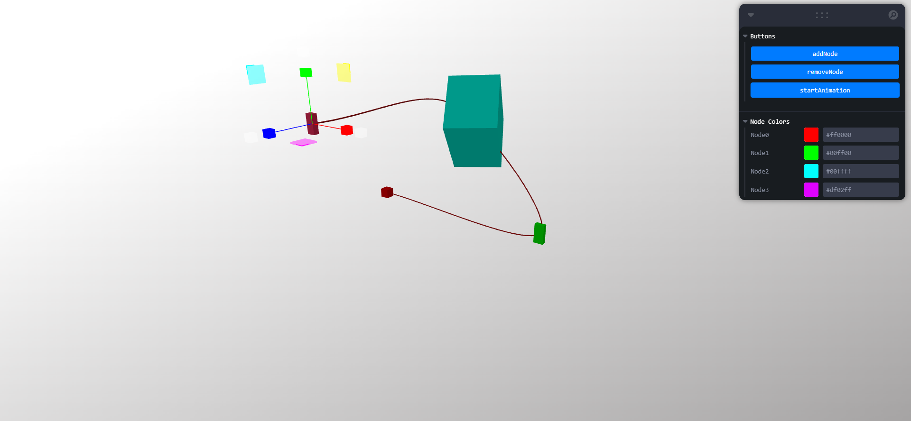

# R3F Curve Animation



## Features
* Nodes with configurable position, scale, rotation and color
* Left click on a node to select it and show Gizmos around it
* Right click on a node to cycle through Gizmo modes (translation, rotation and scale)
* Animated 3D object follows a smooth curve
* Mesh transform and color are interpolated throughout the curve
* Orbit Controls to looks around the scene
* Buttons to add and remove nodes, play animation and Color Pickers to change node colors

## Tech stack
* React
* Three.js
* React Three Fiber
* React Drei helpers
* GSAP for animations
* [Valtio](https://valtio.pmnd.rs/) for [mutable state management](https://docs.pmnd.rs/zustand/getting-started/comparison#valtio)
* [Leva](https://github.com/pmndrs/leva) for floating UI

## Building
```sh
$ git clone git@github.com:DevPika/r3f-curve-anim.git
$ cd r3f-curve-anim
$ npm install
$ npm run dev
```
Visit [http://localhost:5173/](http://localhost:5173/) after dev server boots up.

## Based on
* "Vite + React" template
* [r3f Transform Controls example](https://codesandbox.io/s/btsbj)
